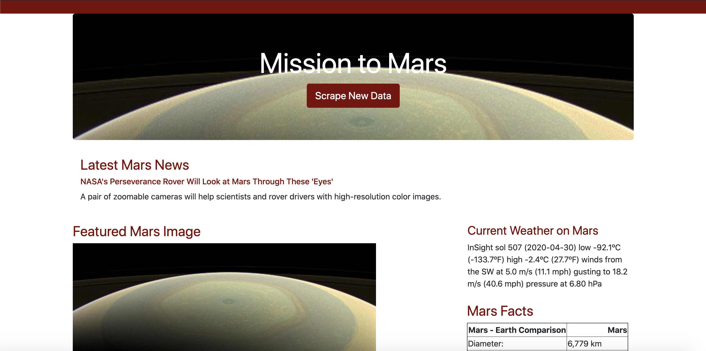

# Web Scraping - Mission to Mars

 A web application that scrapes various websites for data related to the Mission to Mars and displays the information in a single HTML page.

## Step 1 - Scraping
  Initial scraping is done using Jupyter Notebook, BeautifulSoup, Pandas, and Requests/Splinter.

### NASA Mars News

* [NASA Mars News Site](https://mars.nasa.gov/news/) is scraped and the latest News Title and Paragraph Text are collected.

### JPL Mars Space Images - Featured Image

* Splinter is used to navigate to the site and the image url for the current JPL Featured Space Image [here](https://www.jpl.nasa.gov/spaceimages/?search=&category=Mars) is collected.

### Mars Weather

* Latest Mars weather tweet is scrapped from the Mars Weather twitter account [here](https://twitter.com/marswxreport?lang=en).

### Mars Facts

* Facts about planet mars such as  Diameter, Mass, etc. are collected from Mars Facts webpage [here](https://space-facts.com/mars/) using Pandas.

### Mars Hemispheres

* High resolution images and their corresponding titles for each of Mars's hemispheres are collected from  the USGS Astrogeology site [here](https://astrogeology.usgs.gov/search/results?q=hemisphere+enhanced&k1=target&v1=Mars) in a Python dictionary.

  
## Step 2 - MongoDB and Flask Application
MongoDB is used in conjunction with Flask templating to create a new HTML page that displays all of the information collected above.

